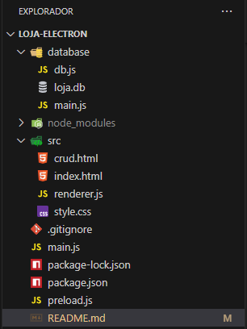

🛍️ Loja Simples Desktop (Electron + Node + SQLite3)
Este projeto é uma aplicação desktop simples de uma loja virtual, desenvolvida com Electron, Node.js e SQLite3.

🚀 Funcionalidades
Cadastro de Produtos (CRUD)

Carrinho de Compras

Adicionar produtos ao carrinho

Cálculo automático do total e quantidade de itens

Interface simples e intuitiva

🛠️ Tecnologias Utilizadas
Electron – Criação da aplicação desktop

HTML, CSS e JavaScript – Interface e lógica da UI

Node.js – Lógica do CRUD e integração com banco de dados

SQLite3 – Banco de dados local

📂 Estrutura do Projeto

💾 Banco de Dados
O banco SQLite é criado automaticamente na pasta do projeto com o nome:

Tabela produtos:

Campo	Tipo
id	INTEGER (PK)
nome	TEXT
preco	REAL

🖥️ Como Rodar o Projeto
1️⃣ Pré-requisitos
Node.js 20.x LTS
(Baixar em: https://nodejs.org/en/download)

⚠️ IMPORTANTE: Atualmente o Electron não suporta oficialmente o Node.js 22.

TANTE

2️⃣ Clone o projeto ou baixe o ZIP
Se for clonar:

git clone https://github.com/renaneliakim1/loja-electron.git
cd loja-electron
Se for por ZIP, basta extrair e abrir a pasta.

3️⃣ Instale as dependências

npm install
npm install electron --save-dev  (Instala o Electron na versão mais recente disponível.)

4️⃣ Rode a aplicação

npm start

⚠️ Possíveis Problemas
Se ocorrer erro com o Electron:

npm cache clean --force
rmdir /s /q node_modules
del package-lock.json
npm install
Execute novamente como Administrador se for Windows.

📝 Licença
MIT

